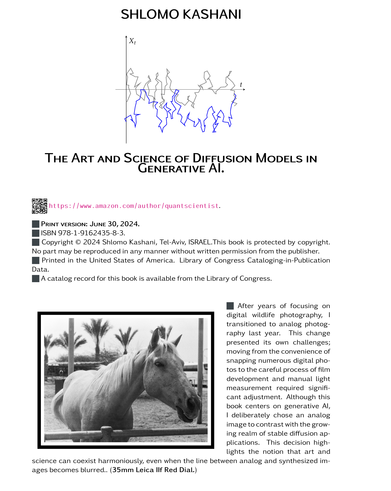

# Welcome to the Book: The Art and Science of Diffusion Models in Generative AI 
(Expected publication date: **end of 2025**)

## Preface
This textbook is expertly crafted for **graduate students** in physics and computer science, offering a semester-long, thorough exploration of Denoising Diffusion Probabilistic Models (DDPMs) within the expansive field of generative AI. Unlike conventional texts that follow a rigid definition-theorem-proof format, **this book adopts a more relaxed and conversational tone**, incorporating extensive commentary, motivation, and explanations to enhance understanding and engagement.

Until recently, diffusion models were a niche known only to a **select group of scientists and engineers**. Generative AI, a field heavily reliant on these models, requires an intricate
understanding of mathematics, physics, stochastic processes, deep learning, and computer science.

This book delves deeply into diffusion models within Generative AI, particularly focusing on **Denoising Diffusion Probabilistic Models (DDPMs)**. While other generative models like Generative Adversarial Networks (GANs), Variational Autoencoders (VAEs), and flow-based models have advanced the generation of high-quality samples, they each have significant drawbacks. GANs can experience unstable training and limited output diversity;
VAEs depend on complex surrogate loss functions, complicating optimization; and flow models necessitate specialized, reversible architectures.

Diffusion models, drawing inspiration from non-equilibrium thermodynamics, present a robust alternative by effectively addressing these challenges. **This volume stands out by
concentrating solely on diffusion models, offering a unique perspective rarely found in other texts.** This focused approach not only simplifies complex ideas for a broader audience
but also pushes the boundaries of what AI can achieve in modern industries and research. As such, this book is an essential resource for anyone seeking to understand the current and
future impacts of technology-driven creative processes in Generative AI.

The book begins with fundamental concepts, such as the introduction of Brownian motion—the simplest form of diffusion—and gradually advances to more complex diffusion equations. This structured approach ensures that readers develop a profound understanding of both forward and backward diffusion processes, providing a solid foundation for advanced studies and applications.

The book offers a detailed exploration of key concepts including Brownian motion, Itô's lemma, Stochastic Differential Equations (SDEs), and the significant role of stochastic processes in artificial intelligence. It provides an exhaustive introduction to diffusion processes, a meticulous examination of DDPMs, and a chapter dedicated to the deep learning architectures fundamental to DDPMs. The narrative is **enriched with a plethora of solved problems** and numerous **programming mini-projects**, concentrating mainly on results that hold substantial relevance for practical implementations. As an extensive graduate-level textbook and reference, it embraces the philosophy that the most effective way to learn about DDPM's is through its application, illustrated through extensive examples that demonstrate the theory in real-world scenarios.

Each chapter of this book integrates theoretical discourse with practical applications, culminating in mini programming projects **using Python**. These projects allow readers to simulate basic theoretical concepts, such as a random walk or Brownian motion, and progress to more sophisticated implementations, such as developing a DDPM. This hands-on approach not only solidifies learning through active engagement but also arms students and professionals with the skills to effectively deploy these advanced models in various real-world contexts.

Furthermore, the text methodically covers topics such as Stochastic Differential Equations (SDEs), Brownian Motion, martingales, and Itô’s lemma. These topics are interlinked within the context of diffusion models, encouraging readers to revisit earlier discussions to fully grasp the complex interrelationships among these concepts. To ensure clarity and accessibility, the text intentionally omits some more esoteric topics, instead focusing on providing foundational knowledge and deep insights essential for a thorough understanding of DDPMs.

## Educational Goals

**Rich with a vast array of fully solved examples and exercises** of varying complexity, this manuscript integrates these into the narrative to enhance and assess the reader's understanding extensively. **These exercises are central to the book's structure**, often referenced in subsequent discussions to encourage a dynamic and interactive learning environment.

Inspired by the **renowned Schaum's Outline series**, the text marries rigorous theoretical exposition with practical applications. This methodology is crafted to reinforce theoretical knowledge through **hands-on problem-solving**, thereby enhancing comprehension.

## Methodological Approach

While the primary focus is theoretical, the text occasionally incorporates code snippets to bridge the gap between theory and practical application, making it ideal for graduate students and professionals committed to mastering diffusion models.

Each section of each chapter is organized to include:
1. An introduction to the concepts,
2. Relevant definitions and theorems,
3. Problems and detailed solutions.

### Example Problem: Standard Brownian Motion and Stochastic Integrals

## Programming Mini-Projects

To enhance the pedagogical value of each chapter and solidify the theoretical concepts presented, the text concludes with a series of practical programming projects. These projects are designed to bridge the gap between theory and practice, enabling readers to apply their newly acquired knowledge in simulated environments. This hands-on approach not only reinforces understanding but also sharpens practical skills essential for advancing in the field of generative AI.

The projects include:
- **1D Simulation of Brownian Motion:** Engage with the fundamental stochastic process by simulating particle movements in a fluid, mimicking the random motion observed by Robert Brown.
- **Forward Diffusion Simulation:** Develop a program to model the progressive addition of noise to a system, illustrating how data evolves into a more chaotic state over time.
- **Backward Diffusion Simulation:** Implement the reverse of the forward diffusion process, demonstrating techniques to recover the original data from its noised state.
- **Ornstein-Uhlenbeck (OU) Process Simulation:** Simulate this mean-reverting stochastic process, commonly used to model interest rates and other financial indicators.
- **Core Denoising Probabilistic Model (DPM) Development:** Construct a basic version of a denoising model to understand the foundational mechanics and algorithms that drive these systems.
- **Full Realization of a Denoising Diffusion Probabilistic Model (DDPM):** Build a comprehensive DDPM to explore its application in generating high-quality synthetic data.
- **Sampling Algorithms Implementation:** Create and test various sampling algorithms that play a crucial role in generating outputs from trained models.

These projects encourage a deep dive into the practical aspects of stochastic processes and diffusion models, preparing readers to tackle real-world problems and innovate within the domain of generative AI.
